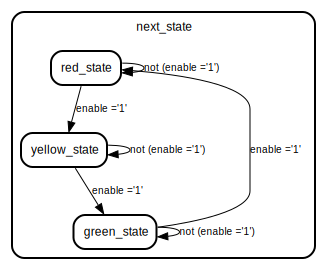

# Entity: traffic_light_system_moore 

- **File**: traffic_light_system_moore.vhdl
## Diagram

## Ports

| Port name | Direction | Type      | Description |
| --------- | --------- | --------- | ----------- |
| clk       | in        | std_logic |             |
| reset     | in        | std_logic |             |
| enable    | in        | std_logic |             |
| red       | out       | std_logic |             |
| yellow    | out       | std_logic |             |
| green     | out       | std_logic |             |
## Signals

| Name          | Type      | Description |
| ------------- | --------- | ----------- |
| current_state | state     |             |
| next_state    | state     |             |
| out_red       | std_logic |             |
| out_yellow    | std_logic |             |
| out_green     | std_logic |             |
## Types

| Name  | Type                                                                                                         | Description |
| ----- | ------------------------------------------------------------------------------------------------------------ | ----------- |
| state | (red_state, yellow_state, green_state) |             |
## Processes
- unnamed: ( clk,reset )
- unnamed: ( current_state, enable )
## State machines

